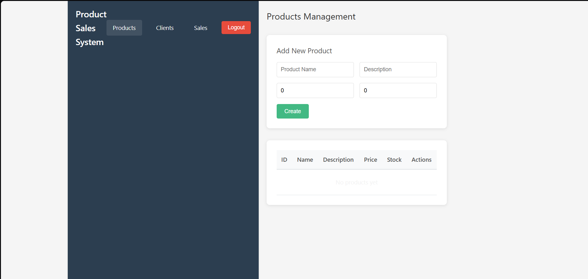

# Product & Sales Management System

🎥 [Haz clic aquí para ver la Demo en Video](product-sales-frontend/src/assets/SalesSystemVidGif.mp4)

Full-stack application for managing products, clients, and sales with secure JWT authentication.

## 🚀 Technologies

### Backend
- **.NET 9.0** (Latest)
- **C#**
- **SQL Server**
- **Entity Framework Core** (Code-First)
- **JWT Authentication** (JSON Web Tokens)
- **BCrypt** for secure password hashing

### Frontend
- **Vue.js 3** (Composition API)
- **Axios** (HTTP Client)
- **Vue Router**
- **Bootstrap / Tailwind** (Visual Framework)

## ✨ Features

- 🔐 **Secure Authentication:** JWT-based login and registration.
- 📦 **Product Management:** Complete CRUD with stock control.
- 👥 **Client Management:** Database of clients.
- 💰 **Sales Processing:** Transactional sales recording.
- 📱 **Responsive Design:** Optimized for mobile and desktop.
- 🔌 **RESTful API:** Clean and standard API architecture.

## 🏛️ Architecture & Patterns

This project follows industry best practices for scalability and maintainability:

- **Layered Architecture:** Strict separation of concerns (Controllers → Services → Data Layer).
- **Service Layer Pattern:** Encapsulates business logic and keeps Controllers clean.
- **SOLID Principles:** Extensive use of Dependency Injection and Interface Segregation.
- **Unit Testing:** Integrated testing suite for backend logic.

## ⚙️ Setup Instructions

### Backend (API)

1. Update the connection string in `appsettings.json`:
~~~json
"ConnectionStrings": {
  "DefaultConnection": "Server=localhost;Database=ProductSalesDB;Trusted_Connection=True;TrustServerCertificate=True"
}
~~~

2. Run migrations:
~~~bash
dotnet ef database update
~~~

3. Start the API:
~~~bash
dotnet run
~~~

### Frontend (Client)

1. Navigate to frontend folder:
~~~bash
cd product-sales-frontend
~~~

2. Install dependencies:
~~~bash
npm install
~~~

3. Start development server:
~~~bash
npm run dev
~~~

## 📡 API Endpoints

### Authentication
- `POST /api/auth/register` - Register new user
- `POST /api/auth/login` - Login and get JWT token

### Products (Protected 🔒)
- `GET /api/products` - Get all products
- `POST /api/products` - Create product
- `GET /api/products/{id}` - Get by ID
- `PUT /api/products/{id}` - Update
- `DELETE /api/products/{id}` - Delete

### Sales (Protected 🔒)
- `GET /api/sales` - Get all sales
- `POST /api/sales` - Create sale

## 👤 Author
**Harold Toribio**